# react-premium-gate

[](https://www.npmjs.com/package/react-premium-gate)
[](LICENSE)
[](https://github.com/iamadhitya1)


> Drop-in React components and hooks for **Razorpay subscription paywalls**. Built for Indian SaaS apps.

Three exports. Zero runtime dependencies. Works with any React app.

<div align="center">
  
</div>

---

## What's included

| Export | Type | What it does |
|--------|------|-------------|
| `<PremiumGate>` | Component | Blocks UI behind a paywall with a customizable CTA |
| `<PricingModal>` | Component | Bottom-sheet pricing modal with plan toggle |
| `usePro` | Hook | Manages Pro status via localStorage + server verification |

Plus **Vercel API templates** in `/templates/api/` for Razorpay subscription creation and HMAC payment verification.

---

## Install

```bash
npm install react-premium-gate
```

---

## Usage

### `usePro`

```jsx
import { usePro } from 'react-premium-gate'

function App() {
  const { isPro, loading, activatePro } = usePro({
    storageKey: 'my_app_sub',           // localStorage key
    verifyEndpoint: '/api/verify-subscription', // optional server check
  })

  if (loading) return null
  return isPro ? <ProContent /> : <FreeContent />
}
```

---

### `<PremiumGate>`

```jsx
import { PremiumGate } from 'react-premium-gate'

<PremiumGate
  onUpgrade={() => setShowModal(true)}
  title="Pro Feature"
  description="Unlock this with a Pro subscription."
  buttonText="Upgrade to Pro — ₹399/mo"
  icon="👑"
  accentColor="#F0B429"
/>
```

**Props**

| Prop | Type | Default |
|------|------|---------|
| `onUpgrade` | `function` | required |
| `title` | `string` | `'Pro Feature'` |
| `description` | `string` | `'Upgrade to Pro to unlock this feature.'` |
| `buttonText` | `string` | `'Upgrade to Pro'` |
| `icon` | `string` | `'👑'` |
| `accentColor` | `string` | `'#F0B429'` |
| `style` | `object` | `{}` |

---

### `<PricingModal>`

```jsx
import { PricingModal } from 'react-premium-gate'

const PLANS = [
  { id: 'monthly', label: 'Monthly', price: '₹399',   period: '/mo' },
  { id: 'yearly',  label: 'Yearly',  price: '₹2,999', period: '/yr', badge: 'Save 37%' },
]

<PricingModal
  isOpen={showModal}
  onClose={() => setShowModal(false)}
  plans={PLANS}
  onSelectPlan={(planId) => handlePayment(planId)}
  accentColor="#F0B429"
  loading={paymentLoading}
/>
```

**Props**

| Prop | Type | Default |
|------|------|---------|
| `isOpen` | `boolean` | required |
| `onClose` | `function` | required |
| `plans` | `array` | `[]` |
| `onSelectPlan` | `function` | required |
| `title` | `string` | `'Upgrade to Pro'` |
| `subtitle` | `string` | `'Less than a coffee. Way more value.'` |
| `icon` | `string` | `'👑'` |
| `accentColor` | `string` | `'#F0B429'` |
| `fineText` | `string` | `'Secure payment · Cancel anytime'` |
| `loading` | `boolean` | `false` |

---

## Razorpay API Templates

Copy the files from `/templates/api/` into your Vercel project's `api/` folder.

```
templates/api/
├── create-subscription.js   # Creates Razorpay subscription server-side
├── verify-payment.js        # Verifies HMAC-SHA256 payment signature
└── verify-subscription.js   # Checks if subscription is still active
```

**Required Vercel env vars:**

```env
RAZORPAY_KEY_ID=rzp_live_xxx
RAZORPAY_KEY_SECRET=your_secret
RAZORPAY_PLAN_MONTHLY=plan_xxx
RAZORPAY_PLAN_YEARLY=plan_xxx
```

---

## Full Example

```jsx
import { useState } from 'react'
import { usePro, PremiumGate, PricingModal } from 'react-premium-gate'

const PLANS = [
  { id: 'monthly', price: '₹399',   period: '/mo' },
  { id: 'yearly',  price: '₹2,999', period: '/yr', badge: 'Save 37%' },
]

export default function App() {
  const { isPro, activatePro } = usePro({
    storageKey: 'my_app_sub',
    verifyEndpoint: '/api/verify-subscription',
  })
  const [showModal, setShowModal] = useState(false)
  const [loading, setLoading] = useState(false)

  const handlePayment = async (planId) => {
    setLoading(true)
    const res = await fetch(`/api/create-subscription?plan=${planId}`)
    const { subscriptionId } = await res.json()

    const rzp = new window.Razorpay({
      key: process.env.VITE_RAZORPAY_KEY_ID,
      subscription_id: subscriptionId,
      handler: async (response) => {
        const verify = await fetch('/api/verify-payment', {
          method: 'POST',
          headers: { 'Content-Type': 'application/json' },
          body: JSON.stringify(response),
        })
        const { valid, subscriptionId: subId } = await verify.json()
        if (valid) { activatePro(subId); setShowModal(false) }
        setLoading(false)
      },
    })
    rzp.open()
  }

  return (
    <>
      {!isPro && (
        <PremiumGate
          onUpgrade={() => setShowModal(true)}
          title="Analytics — Pro only"
          description="Unlock detailed charts and AI insights."
          buttonText="Upgrade to Pro"
        />
      )}

      <PricingModal
        isOpen={showModal}
        onClose={() => setShowModal(false)}
        plans={PLANS}
        onSelectPlan={handlePayment}
        loading={loading}
      />
    </>
  )
}
```

---

## License

MIT © 2025 [M Adhitya](https://github.com/iamadhitya1)

Built at [Rewrite Labs](https://rewritelabs.vercel.app) · Used in production across the Rewrite Labs app suite.
